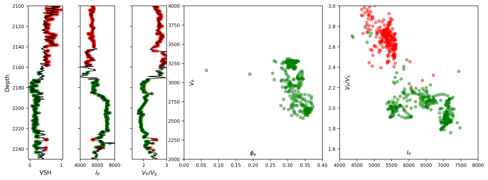
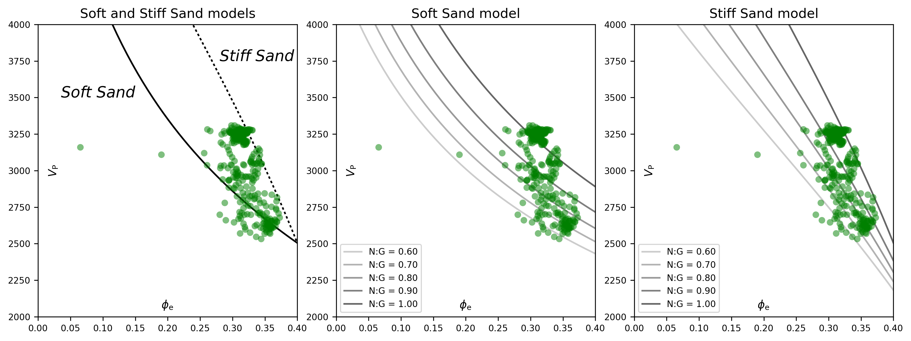
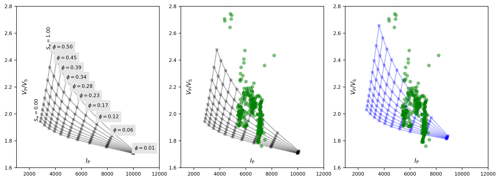
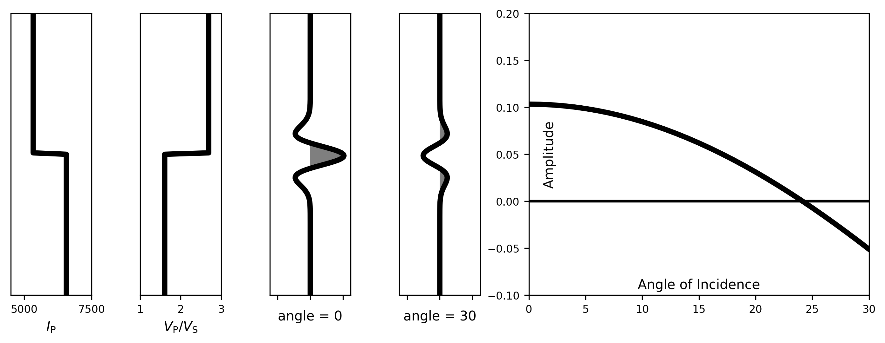

# Seismic rock physics

### Alessandro Amato del Monte, Eni Norge AS, Stavanger, Norway

_Corresponding author: alessandro.amato.del.monte@eni.com_

Rock physics studies the relationship between physical and elastic properties of rocks and is the basis of quantitative seismic interpretation. It has arguably given exploration geophysicists a solid quantitative basis to their interpretation of seismic data. It can be tackled at different scales of investigation by people with various backgrounds &mdash; from geophysicists to civil engineers, from mathematicians to petrophysicists.

In this tutorial, and the Python code in the accompanying Jupyter Notebook (https://github.com/seg/tutorials), I offer a practical introduction to rock physics, showing how to code simple models and apply them to analyse well log data and predict their seismic responses. Here's the workflow:

1. Data exploration &mdash; inspecting what we have.
2. Rock physics modeling &mdash; two simple models.
3. Rock physics templates &mdash; modeling more parameters.
4. Seismic response modeling &mdash; predicting seismic.

The well data used in this tutorial is one of the datasets available on the _Quantitative Seismic Interpretation_ book website (Avseth et al., 2005).

## Data exploration

We get our bearings by plotting the logs together. Figure 1a shows VSH (shale volume) log in the first track, $I_\mathrm{P}$ (P-wave impedance) in the second track, and $V_\mathrm{P} / V_\mathrm{S}$ (the ratio of P-wave to S-wave velocities) in the third. I highlight sands in yellow and shales in red. Next to these three tracks are crossplots of $V_\mathrm{P}$ against effective porosity $\phi_\mathrm{e}$ (Fig. 1b), and of $V_\mathrm{P} / V_\mathrm{S}$ against $I_\mathrm{P}$ (Fig. 1c).

In the $V_\mathrm{P}$&ndash;$\phi_\mathrm{e}$ crossplot I have decided to avoid plotting shales since effective porosity is zero for pure shales so this plot will not help in the analysis of non-reservoir rocks.

**Figure 1.** (a) Shale volume (VSH), P-wave impedance ($I_\mathrm{P}$ in 10^3 kg s&ndash;1 m&ndash;2), and $V_\mathrm{P} / V_\mathrm{S}$ for the interval 2100 m to 2250 m. (b) P-wave velocity ($V_\mathrm{P}$ in m/s) vs effective porosity ($\phi_\mathrm{e}$). (c) $V_\mathrm{P} / V_\mathrm{S}$ vs $I_\mathrm{P}$.

<!-- I changed the units for Ip then removed the LaTeX formatting: ($I_\mathrm{P}$ in $\mathrm{m} / \mathrm{s} \cdot \mathrm{g} / \mathrm{cm}^3$) -->

## Rock physics modeling

Rock physics models output dry-rock frame moduli: bulk modulus $K_\mathrm{d}$ and shear modulus $\mu_\mathrm{d}$. These moduli represent the resistance of the rock's dry frame to normal and tangential stress respectively. They are used together with Gassmann's equation to calculate the saturated rock moduli ($K$ and $\mu$) which are, together with density, the building blocks for P-wave and S-wave velocities, $V_\mathrm{P}$ and $V_\mathrm{S}$:

$$V_\mathrm{P} = \sqrt{\frac{K + 4\mu / 3}{\rho}} \ \ \ \ V_\mathrm{S} = \sqrt{\frac{\mu}{\rho}}$$

The product of velocity and density is called acoustic impedance. Impedance contrasts are ultimately what generate seismic reflections; this is why rock physics, by linking rock and fluid properties to velocities, allows us to understand and explain seismic reflections.

In many cases, we know the velocity and density of a non-reservoir sandstone, and would like to know how these quantities will change if the porosity were only higher, the net:gross (N:G) more favourable, or the fluid more valuable. We need a model!

In the notebook, I introduce two simple but useful models, the Soft Sand model and the Stiff Sand model. The notebook provides the theory and the code to help you understand these models. Here I only show what they produce.

We'd like to know how well our data fit the models we make. The easiest way is to look at them both in one plot. Figure 2a shows the same interval as before &mdash; the reservoir sand from 2100 m to 2250 m &mdash; with the Soft Sand model and the Stiff Sand model superimposed. At first sight, both models may offer a good starting point to investigate these sands.

**Figure 2.** $V_\mathrm{P}$ vs $\phi_\mathrm{e}$ for the reservoir interval shown in Figure 1. (a) The Soft Sand model is shown as a black line; the Stiff Sand model is a discontinuous line. (b) The Soft Sand model and (c) the Stiff Sand model with varying N:G.

The sands are not hydrocarbon-bearing so I can dismiss fluid effects and start leveraging the rock physics model by displaying how mineralogy affects the velocities. To do that, I will simplify the problem assuming variations in N:G. When N:G is 1, then the mineral moduli will be equal to those of quartz, when it is lower than 1 than I will use composite mineral moduli given by the Voigt&ndash;Reuss&ndash;Hill average of quartz and a generic shale. So to compute the bulk modulus given the constituent volume fractions _f_:

$$K_\mathrm{Voigt} = (f_\mathrm{qz} \cdot K_\mathrm{qz}) + (f_\mathrm{sh} \cdot K_\mathrm{sh})$$

$$K_\mathrm{Reuss} = \frac{1} { (f_\mathrm{qz} / K_\mathrm{qz}) + (f_\mathrm{sh} / K_\mathrm{sh}) }$$

$$K_\mathrm{Hill} = \frac{K_\mathrm{Voigt} + K_\mathrm{Reuss}}{2}$$

Now let's put it all together and show how the models change for different mineralogies. There's just one catch: to have the models spread out to cover the entire range of the well data, I had to code them with different parameters. In the notebook, these are the lines that call the two models:

    Kdry, MUdry = softsand(K0, MU0, phi, phic=0.5, Cn=12, P=45)
    Kdry, MUdry = stiffsand(K0, MU0, phi, phic=0.4, Cn=8, P=45)

The Soft Sand model uses higher critical porosity and coordination number than the Stiff Sand model, which means that the reservoir sands can be described by either a stiffer 'soft' sand or a softer 'stiff' sand (the coordination number `Cn` suggests a closer packing of the individual grains that make up our sand, which in turn means a more compact and harder material).

Figures 2b and 2c show the result of plotting the data against the two models. So far, both models fit the datapoints. It is up to the interpreter to decide which model is more appropriate. Adding the effect of hydrocarbons, and changing other parameters &mdash; especially porosity &mdash; might help us figure it out.

## Rock physics templates

The set of models for varying degrees of N:G shown above are a basic example of rock physics templates (RPTs), as promoted by Avseth et al. (2005). From that starting point, it is fairly easy to build a function to create RPTs which show not only variations in porosity and mineralogy but also fluid content.

In the notebook, I show how to combine the functions to compute $K_\mathrm{dry}$ and $\mu_\mathrm{dry}$ for the Soft Sand and Stiff Sand models with the velocities given by Gassmann's equation, to produce arrays of P-wave impedance $I_\mathrm{P}$ and $V_\mathrm{P}/V_\mathrm{S}$ that we can study individually &mdash; as in Figure 3a &mdash; or overlay on top of well data as an aid to interpretation &mdash; as in Figures 3b and 3c.

**Figure 3.** Rock physics templates for the Soft Sand model. (a) The template by itself, showing how we expect $V_\mathrm{P}/V_\mathrm{S}$ and $I_\mathrm{P}$ to vary with water saturation ($S_\mathrm{w}$) and porosity ($\phi_\mathrm{e}$). (b) The template (gray) plotted with the data (green). (c) The template (blue) has been recalculated by changing the rock matrix moduli, assuming higher proportion of quartz (i.e., cleaner sands).

We can go further, for example one can check the validity of the elastic moduli assigned to the second mineral (the one I have referred to as 'shale') by varying them and displaying different RPTs. In Figure 3c I have changed the bulk and shear modulus values to get a better fit against the data. In the absence of other information, this is perfectly reasonable — and valuable — knowledge to add to the exploration puzzle.

## Seismic response modeling

Once I have a good grasp of the RPM and the way it reacts to different input parameters, I can start using it to explore seismic data too. It is very easy to use the velocities and densities output by our rock physics model to build simple two-layer models and analyse seismic and AVO signatures of the modeled top reservoir. One example is shown in Figure 4; the idea is fully developed in the accompanying Jupyter Notebook.

**Figure 4.** The expected seismic response of a gas-saturated sand with 15% porosity. From left to right: P-wave impedance  $I_\mathrm{P}$, $V_\mathrm{P}/V_\mathrm{S}$, the response at 0 degrees and 30 degrees of offset, and the amplitude-vs-angle curve.

## Conclusions

I have shown here how I implement rock physics models and templates using standard Python libraries. The functions introduced here can be extended fairly easily for additional rock physics models, some of which are shown in the accompanying notebook (https://github.com/seg/tutorials). The workflow  can be used to study real datasets, analyse the elastic behaviour of individual reservoirs, and build a collection of seismic and AVO signatures to be associated to particular combinations of caprocks and reservoirs.

## References

Avseth, P., Mukerji, T. & Mavko, G. (2005). _Quantitative Seismic Interpretation._ Cambridge University Press. Data repository: http://ageo.co/QSIdata
